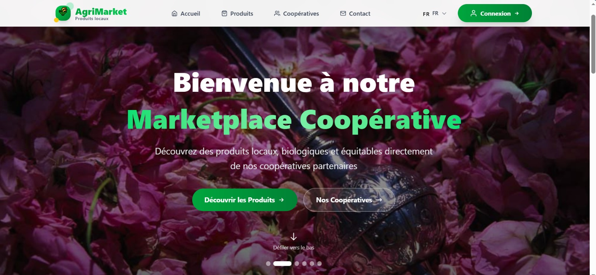

# 🚀 GUIDE DE LANCEMENT - COOPERATIVE MARKET

## 📋 Table des Matières
1. [Prérequis](#prérequis)
2. [Installation Automatique](#installation-automatique)
3. [Installation Manuelle](#installation-manuelle)
4. [Comptes par Défaut](#comptes-par-défaut)
5. [Résolution des Problèmes](#résolution-des-problèmes)

---

## 🔧 Prérequis

Avant de commencer, assurez-vous d'avoir installé:

### Obligatoire:
- **PHP 8.1 ou supérieur** - [Télécharger PHP](https://www.php.net/downloads)
- **Composer** - [Télécharger Composer](https://getcomposer.org/download/)
- **Node.js 16 ou supérieur** - [Télécharger Node.js](https://nodejs.org/)
- **MySQL ou MariaDB** - [Télécharger MySQL](https://dev.mysql.com/downloads/)

### Vérifier les installations:
```bash
php -v        # Doit afficher PHP 8.1+
composer -V   # Doit afficher Composer 2.x
node -v       # Doit afficher v16+
npm -v        # Doit afficher 8+
mysql -V      # Doit afficher MySQL/MariaDB
```

---

## 🎯 Installation Automatique (Recommandé)

### Étape 1: Extraire le projet
```bash
# Télécharger et extraire le ZIP
unzip cooperative-market-fixed.zip
cd FINAL-PROJET
```

### Étape 2: Lancer le script d'installation
```bash
# Rendre le script exécutable
chmod +x SETUP.sh

# Lancer l'installation
./SETUP.sh
```

Le script va automatiquement:
- ✅ Installer les dépendances Laravel (composer install)
- ✅ Créer le fichier .env
- ✅ Générer la clé d'application
- ✅ Créer les tables de la base de données
- ✅ Créer le lien symbolique storage
- ✅ Installer les dépendances React (npm install)
- ✅ (Optionnel) Insérer des données de test

### Étape 3: Configurer la base de données

Pendant l'exécution du script, vous serez invité à configurer la base de données.

**Ouvrir le fichier `.env`** dans `laravel-main/`:
```bash
cd laravel-main
nano .env    # ou utilisez votre éditeur préféré
```

**Modifier ces lignes:**
```env
DB_CONNECTION=mysql
DB_HOST=127.0.0.1
DB_PORT=3306
DB_DATABASE=cooperative_market    # Nom de votre base de données
DB_USERNAME=root                  # Votre utilisateur MySQL
DB_PASSWORD=votre_mot_de_passe   # Votre mot de passe MySQL
```

**Créer la base de données dans MySQL:**
```bash
# Se connecter à MySQL
mysql -u root -p

# Créer la base de données
CREATE DATABASE cooperative_market CHARACTER SET utf8mb4 COLLATE utf8mb4_unicode_ci;

# Quitter MySQL
exit;
```

### Étape 4: Lancer l'application

**Terminal 1 - Backend Laravel:**
```bash
cd laravel-main
php artisan serve
```
✅ Le backend sera accessible sur: **http://localhost:8000**

**Terminal 2 - Frontend React (nouveau terminal):**
```bash
cd react-main
npm run dev
```
✅ Le frontend sera accessible sur: **http://localhost:5173**

### Étape 5: Accéder à l'application
Ouvrir votre navigateur et aller sur: **http://localhost:5173**

---

## 📝 Installation Manuelle (Étape par Étape)

Si le script automatique ne fonctionne pas, suivez ces étapes manuellement:

### PARTIE 1: Configuration du Backend (Laravel)

#### 1.1 Installer les dépendances PHP
```bash
cd laravel-main
composer install
```

#### 1.2 Créer le fichier de configuration
```bash
cp .env.example .env
```

#### 1.3 Modifier le fichier .env
```bash
nano .env
```

**Configuration minimale requise:**
```env
APP_NAME="Cooperative Market"
APP_ENV=local
APP_DEBUG=true
APP_URL=http://localhost:8000

DB_CONNECTION=mysql
DB_HOST=127.0.0.1
DB_PORT=3306
DB_DATABASE=cooperative_market
DB_USERNAME=root
DB_PASSWORD=votre_mot_de_passe
```

#### 1.4 Créer la base de données
```bash
# Se connecter à MySQL
mysql -u root -p

# Dans MySQL, taper:
CREATE DATABASE cooperative_market CHARACTER SET utf8mb4 COLLATE utf8mb4_unicode_ci;
exit;
```

#### 1.5 Générer la clé d'application
```bash
php artisan key:generate
```

#### 1.6 Exécuter les migrations
```bash
php artisan migrate
```

**Si vous voyez des erreurs, vérifiez:**
- ✅ MySQL est démarré
- ✅ Les identifiants dans .env sont corrects
- ✅ La base de données existe

#### 1.7 Créer le lien symbolique pour le stockage
```bash
php artisan storage:link
```

#### 1.8 (Optionnel) Insérer des données de test
```bash
php artisan db:seed --class=EasySeeder
```

#### 1.9 Démarrer le serveur Laravel
```bash
php artisan serve
```

✅ **Backend lancé sur: http://localhost:8000**

---

### PARTIE 2: Configuration du Frontend (React)

**Ouvrir un NOUVEAU terminal** (ne pas fermer le précédent)

#### 2.1 Aller dans le dossier React
```bash
cd react-main
```

#### 2.2 Installer les dépendances Node
```bash
npm install
```

**Si vous avez des erreurs:**
```bash
# Nettoyer le cache npm
npm cache clean --force

# Supprimer node_modules et réinstaller
rm -rf node_modules package-lock.json
npm install
```

#### 2.3 Démarrer le serveur React
```bash
npm run dev
```

✅ **Frontend lancé sur: http://localhost:5173**

---

### PARTIE 3: Accéder à l'application

1. Ouvrir votre navigateur
2. Aller sur: **http://localhost:5173**
3. Vous devriez voir la page d'accueil du site


## 🎯 Tester que tout fonctionne

### Test 1: Backend Laravel
Ouvrir dans le navigateur: **http://localhost:8000/api/cooperatives**

Vous devriez voir un JSON avec les coopératives:
```json
{
  "success": true,
  "data": [...],
  "count": 3
}
```

### Test 2: Frontend React
Ouvrir dans le navigateur: **http://localhost:5173**

Vous devriez voir:
- ✅ La page d'accueil du site
- ✅ Un menu de navigation
- ✅ Des sections Hero, À propos, Contact

## 🔧 Résolution des Problèmes

### ❌ Problème: "SQLSTATE[HY000] [1045] Access denied"

**Cause:** Mauvais identifiants MySQL dans .env

**Solution:**
```bash
# Vérifier vos identifiants MySQL
mysql -u root -p

# Si ça ne marche pas, réinitialiser le mot de passe MySQL
# ou créer un nouvel utilisateur
```

---

### ❌ Problème: "Class 'PDO' not found"

**Cause:** Extension PHP PDO non installée

**Solution Ubuntu/Debian:**
```bash
sudo apt-get install php-mysql php-pdo
```

**Solution macOS (avec Homebrew):**
```bash
brew install php@8.1
```

**Solution Windows:**
Décommenter dans `php.ini`:
```ini
extension=pdo_mysql
```

---

### ❌ Problème: "npm ERR! code ELIFECYCLE"

**Cause:** Problème avec node_modules

**Solution:**
```bash
cd react-main
rm -rf node_modules package-lock.json
npm cache clean --force
npm install
```

---

### ❌ Problème: Port 8000 déjà utilisé

**Solution 1: Utiliser un autre port**
```bash
php artisan serve --port=8001
```

**Solution 2: Trouver et arrêter le processus**
```bash
# Linux/Mac
lsof -ti:8000 | xargs kill -9

# Windows
netstat -ano | findstr :8000
taskkill /PID [numéro_du_PID] /F
```

---

### ❌ Problème: Port 5173 déjà utilisé

**Solution 1: Tuer le processus**
```bash
# Linux/Mac
lsof -ti:5173 | xargs kill -9

# Windows
netstat -ano | findstr :5173
taskkill /PID [numéro_du_PID] /F
```

**Solution 2: Modifier vite.config.js**
```javascript
export default defineConfig({
  server: {
    port: 3000  // Changer le port
  }
})
```

---

### ❌ Problème: "Cross-Origin Request Blocked"

**Cause:** CORS non configuré

**Solution:** Vérifier dans `laravel-main/config/cors.php`:
```php
'paths' => ['api/*'],
'allowed_origins' => ['http://localhost:5173'],
'allowed_methods' => ['*'],
```

---

### ❌ Problème: Images ne s'affichent pas

**Cause:** Lien symbolique storage non créé

**Solution:**
```bash
cd laravel-main
php artisan storage:link

# Vérifier que le dossier existe
ls -la public/storage
```

---

### ❌ Problème: "Unauthenticated" après connexion

**Cause:** Token non sauvegardé

**Solution:**
1. Ouvrir la Console du navigateur (F12)
2. Aller dans "Application" → "Local Storage"
3. Vérifier que `token` et `user` existent
4. Si non, réessayer de se connecter

---

### ❌ Problème: Dropdown coopératives vide

**Cause:** API ne retourne pas de données

**Solution:**
```bash
# Vérifier qu'il y a des coopératives dans la DB
cd laravel-main
php artisan tinker

# Dans tinker, taper:
App\Models\Cooperative::count();
# Si c'est 0, insérer des données:
exit();
php artisan db:seed --class=EasySeeder
```

---

### ❌ Problème: "Class ... not found" après installation

**Cause:** Autoload non régénéré

**Solution:**
```bash
cd laravel-main
composer dump-autoload
php artisan config:clear
php artisan cache:clear
```

---

## 📱 Accès depuis un autre appareil

Si vous voulez accéder à l'app depuis votre téléphone ou autre PC:

### 1. Trouver votre IP locale
```bash
# Linux/Mac
ifconfig | grep "inet "

# Windows
ipconfig
```

Exemple: `192.168.1.100`

### 2. Démarrer Laravel sur toutes les interfaces
```bash
php artisan serve --host=0.0.0.0 --port=8000
```

### 3. Modifier l'URL de l'API dans React

Dans tous les fichiers React qui appellent l'API, remplacer:
```javascript
// Avant
http://localhost:8000/api/...

// Après
http://192.168.1.100:8000/api/...
```

### 4. Accéder depuis l'autre appareil
Ouvrir: `http://192.168.1.100:5173`

---

## 🔄 Commandes Utiles

### Laravel (Backend)

```bash
# Voir les routes disponibles
php artisan route:list

# Nettoyer le cache
php artisan cache:clear
php artisan config:clear
php artisan view:clear

# Recréer la base de données (ATTENTION: efface tout!)
php artisan migrate:fresh --seed

# Voir les logs en temps réel
tail -f storage/logs/laravel.log

# Créer un nouvel utilisateur
php artisan tinker
User::create(['name'=>'Test', 'email'=>'test@test.com', 'password'=>bcrypt('password'), 'role'=>'admin']);
```

### React (Frontend)

```bash
# Nettoyer et réinstaller
rm -rf node_modules package-lock.json
npm install

# Build pour production
npm run build

# Voir la version de Node
node -v
```

---

## 📊 Structure des Dossiers

```
fixed-project/
│
├── laravel-main/          # Backend Laravel
│   ├── app/
│   │   ├── Http/
│   │   │   └── Controllers/  # Contrôleurs API
│   │   └── Models/        # Modèles (User, Cooperative, Product)
│   ├── database/
│   │   └── migrations/    # Fichiers de migration
│   ├── routes/
│   │   └── api.php        # Routes de l'API
│   ├── .env               # Configuration (créé après setup)
│   └── public/
│       └── uploads/       # Images uploadées
│
└── react-main/            # Frontend React
    ├── src/
    │   ├── pages/
    │   │   ├── Admin/     # Pages admin
    │   │   └── Manager/   # Pages manager
    │   └── components/    # Composants réutilisables
    └── package.json       # Dépendances Node
```

---

## 🎓 Premiers Pas après Installation

### 2. Créer une coopérative
- Dans le dashboard admin, cliquer "Gérer les coopératives"
- Cliquer "+ Ajouter une Coopérative"
- Remplir le formulaire
- Sauvegarder


### 4. Créer un produit
- Cliquer "Gestion des Produits"
- Cliquer "+ Add New Product"
- Sélectionner une coopérative dans le dropdown
- Remplir les informations du produit
- Sauvegarder

✅ **Félicitations! Votre application fonctionne!** 🎉

---

## 📞 Support

Si vous rencontrez des problèmes:

1. **Vérifier les logs Laravel:**
   ```bash
   tail -f laravel-main/storage/logs/laravel.log
   ```

2. **Vérifier la console du navigateur:**
   - Appuyer sur F12
   - Onglet "Console"
   - Chercher les erreurs en rouge

3. **Vérifier les prérequis:**
   - PHP 8.1+ installé
   - MySQL démarré
   - Ports 8000 et 5173 disponibles

4. **Consulter la documentation:**
   - `FIXES_APPLIED.md` - Explications détaillées des corrections
   - `TESTING_GUIDE.md` - Guide de tests complets

---

## 🎯 Résumé Rapide

```bash
# 1. Extraire
unzip cooperative-market-fixed.zip
cd fixed-project

# 2. Backend
cd laravel-main
composer install
cp .env.example .env
# Modifier .env avec vos identifiants MySQL
php artisan key:generate
php artisan migrate
php artisan db:seed --class=EasySeeder
php artisan serve

# 3. Frontend (nouveau terminal)
cd react-main
npm install
npm run dev

# 4. Accéder
# http://localhost:5173
```


Bonne chance! 🚀
